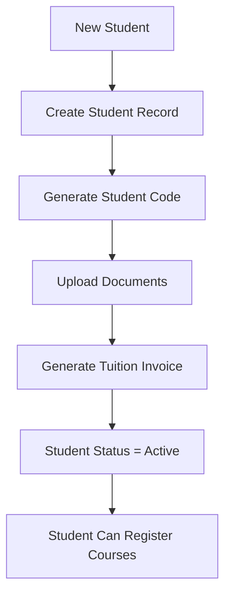
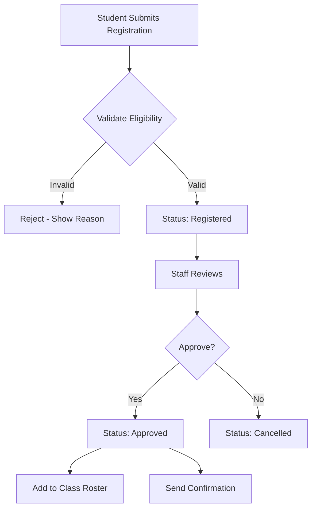
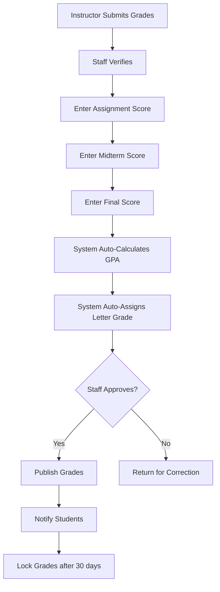
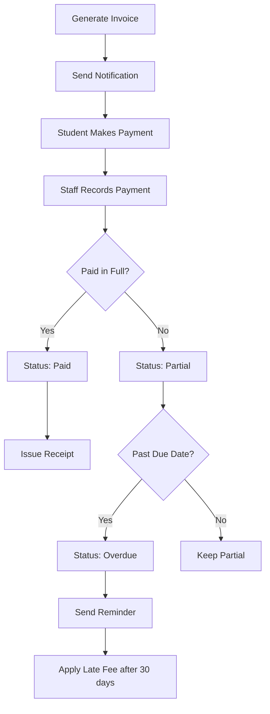
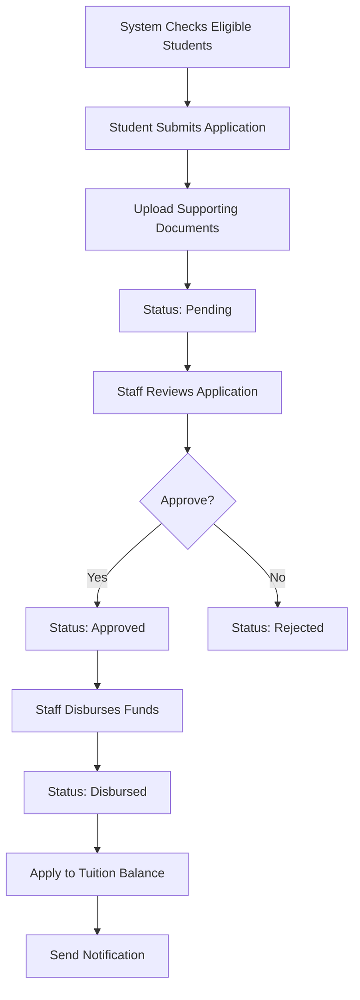
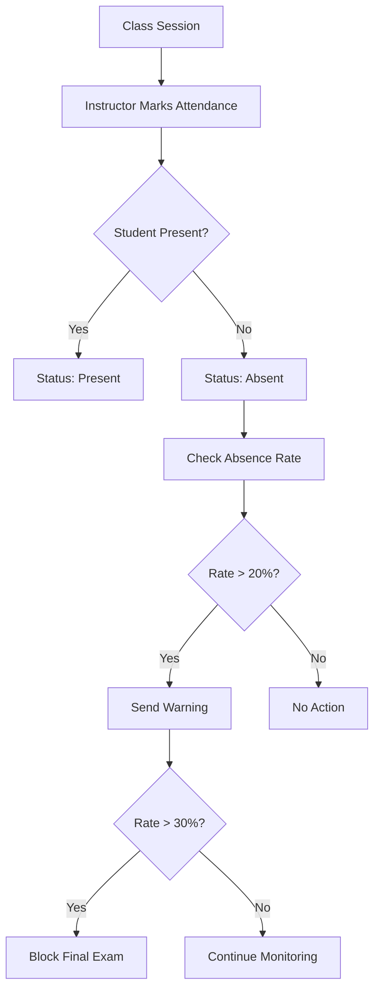
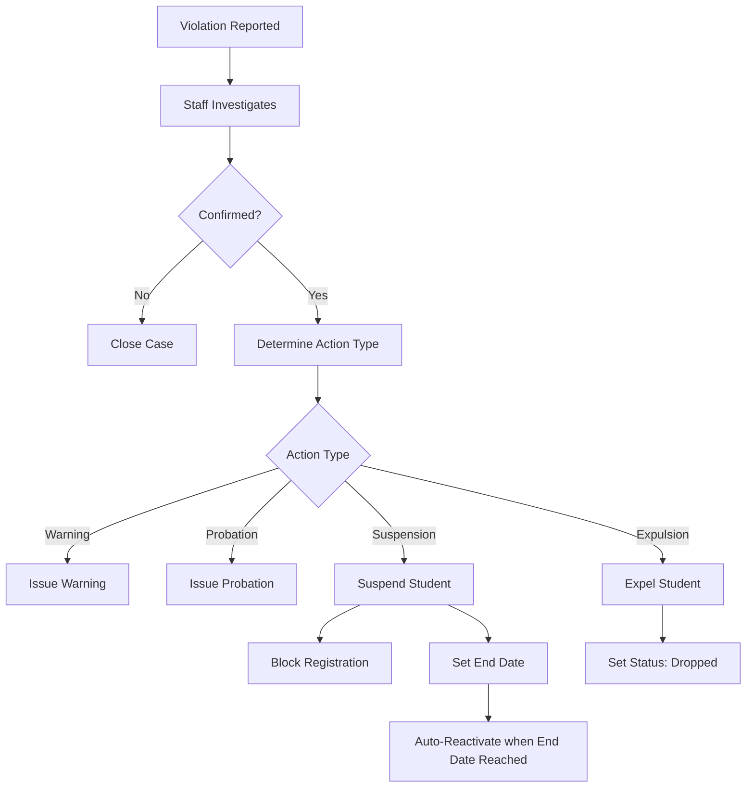

# KẾ HOẠCH NGHIỆP VỤ BACKEND - HỆ THỐNG QUẢN LÝ SINH VIÊN

## 📋 MỤC LỤC
1. [Tổng quan kiến trúc](#1-tổng-quan-kiến-trúc)
2. [Authentication & Authorization](#2-authentication--authorization)
3. [Modules nghiệp vụ chính](#3-modules-nghiệp-vụ-chính)
4. [API Endpoints chi tiết](#4-api-endpoints-chi-tiết)
5. [Business Rules & Validation](#5-business-rules--validation)
6. [Workflows nghiệp vụ](#6-workflows-nghiệp-vụ)
7. [Performance & Optimization](#7-performance--optimization)
8. [Error Handling & Logging](#8-error-handling--logging)

---

## 1. TỔNG QUAN KIẾN TRÚC

### Technology Stack
- **Framework**: ASP.NET Core 8.0 Web API
- **Database**: PostgreSQL
- **ORM**: Entity Framework Core
- **Authentication**: JWT Bearer Token
- **Documentation**: Swagger/OpenAPI
- **Caching**: Redis (optional)
- **File Storage**: Azure Blob Storage / Local File System

### Layered Architecture
```
┌─────────────────────────────────────┐
│   Controllers (API Layer)           │
├─────────────────────────────────────┤
│   Services (Business Logic)         │
├─────────────────────────────────────┤
│   Repositories (Data Access)        │
├─────────────────────────────────────┤
│   Data Models & DbContext           │
└─────────────────────────────────────┘
```

### Project Structure
```
StudentManagement.API/
├── Controllers/          # API Controllers
├── Services/             # Business Logic
├── Repositories/         # Data Access Layer
├── Models/
│   ├── Entities.cs      # Database Entities
│   ├── DTOs.cs          # Data Transfer Objects
│   └── ViewModels.cs    # Response Models
├── Data/
│   └── AppDbContext.cs  # EF Core Context
├── Middleware/          # Custom Middleware
├── Filters/             # Action Filters
├── Validators/          # Input Validation
├── Helpers/             # Utility Classes
└── Configurations/      # App Settings
```

---

## 2. AUTHENTICATION & AUTHORIZATION

### 2.1 Authentication Flow

#### Login Process
```
POST /api/auth/login
Request: { username, password }
Response: { token, refreshToken, user, expiresIn }
```

**Business Logic:**
1. Validate username/password format
2. Check user exists and is_active = true
3. Verify password hash (BCrypt)
4. Generate JWT token (30 min expiry)
5. Generate refresh token (7 days expiry)
6. Log login activity
7. Return user info + tokens

#### Token Refresh
```
POST /api/auth/refresh-token
Request: { refreshToken }
Response: { token, refreshToken, expiresIn }
```

#### Logout
```
POST /api/auth/logout
Authorization: Bearer {token}
Response: { success: true }
```

### 2.2 Authorization Roles

| Role  | Permissions |
|-------|-------------|
| **Admin** | Full system access, user management, system configuration |
| **Staff** | Manage students, grades, attendance, tuition, limited reports |

### 2.3 Permission Matrix

| Endpoint | Admin | Staff |
|----------|-------|-------|
| User Management | ✅ | ❌ |
| Student CRUD | ✅ | ✅ |
| Grade Entry | ✅ | ✅ |
| Tuition Management | ✅ | ✅ |
| Scholarships Approval | ✅ | ❌ |
| Disciplinary Actions | ✅ | ✅ |
| System Reports | ✅ | 📊 (limited) |

---

## 3. MODULES NGHIỆP VỤ CHÍNH

### Module 1: User Management (Admin only)
**Entities:** `users`

**Features:**
- ✅ Create/Update/Delete user accounts
- ✅ Activate/Deactivate users
- ✅ Reset password
- ✅ Assign roles
- ✅ View user activity logs

---

### Module 2: Department & Instructor Management
**Entities:** `departments`, `instructors`

**Features:**
- ✅ CRUD departments
- ✅ CRUD instructors
- ✅ Assign instructors to departments
- ✅ View instructor teaching schedule
- ✅ Instructor performance reports

---

### Module 3: Course & Class Management
**Entities:** `courses`, `classes`, `class_courses`

**Features:**
- ✅ CRUD courses (code, name, credits, description)
- ✅ CRUD classes (academic year, semester, max students)
- ✅ Assign courses to classes with instructor
- ✅ Set schedule and room
- ✅ Check class capacity before enrollment

**Business Rules:**
- Course code must be unique
- Class code format: `{DEPT}-K{YEAR}{CLASS}` (e.g., CNTT-K21A)
- Cannot delete course if students have grades
- Max students per class: 30-50 (configurable)

---

### Module 4: Student Management
**Entities:** `students`

**Features:**
- ✅ CRUD student profiles
- ✅ Search/Filter (by name, code, class, department, status)
- ✅ Bulk import students (CSV/Excel)
- ✅ Student status management (active, suspended, graduated, dropped)
- ✅ Student photo upload
- ✅ View full student record (grades, tuition, attendance)

**Business Rules:**
- Student code format: `SV{YEAR}{NUMBER}` (e.g., SV21001)
- Email must be unique
- Cannot delete student with existing grades/tuition records
- Set student to 'graduated' only if GPA >= 2.0 and no outstanding tuition
- Age must be 17-35

---

### Module 5: Student Registration
**Entities:** `student_registrations`, `class_courses`

**Features:**
- ✅ Student registers for courses
- ✅ Staff approves/rejects registrations
- ✅ Cancel registrations before deadline
- ✅ Check prerequisites
- ✅ Check schedule conflicts
- ✅ Check class capacity

**Business Rules:**
- Registration period: 2 weeks before semester starts
- Max 7 courses per semester
- Total credits per semester: 15-24
- Cannot register for same course twice in same semester
- Check class capacity before approval

**Workflow:**
1. Student submits registration → status: `registered`
2. System validates (capacity, prerequisites, conflicts)
3. Staff reviews and approves → status: `approved`
4. Or staff rejects → status: `cancelled`

---

### Module 6: Grade Management
**Entities:** `grades`

**Features:**
- ✅ Enter/Update grades (assignment, midterm, final)
- ✅ Auto-calculate GPA (weight: 0.2, 0.3, 0.5)
- ✅ Auto-assign letter grade based on GPA
- ✅ Bulk import grades (Excel)
- ✅ Grade distribution reports
- ✅ Grade history by student
- ✅ Export transcripts

**Business Rules:**
- Scores: 0-10, up to 2 decimal places
- GPA calculation: `(assignment*0.2 + midterm*0.3 + final*0.5)`
- Letter grade mapping:
  - A+: 9.0-10.0
  - A:  8.5-8.99
  - B+: 8.0-8.49
  - B:  7.0-7.99
  - C+: 6.5-6.99
  - C:  5.5-6.49
  - D+: 5.0-5.49
  - D:  4.0-4.99
  - F:  0-3.99
- Cannot modify grades after semester end + 30 days (admin can override)
- Unique constraint: (student_id, course_id, academic_year, semester)

---

### Module 7: Attendance Management
**Entities:** `attendance`, `class_courses`

**Features:**
- ✅ Mark attendance (present, absent, late, excused)
- ✅ Bulk attendance entry
- ✅ Attendance reports by class/student
- ✅ Absence notifications
- ✅ Attendance statistics

**Business Rules:**
- Can mark attendance up to 7 days in past
- Absence rate > 20% → Warning notification
- Absence rate > 30% → Cannot take final exam
- Unique: (student_id, class_course_id, check_date)

---

### Module 8: Exam Schedule Management
**Entities:** `exam_schedules`

**Features:**
- ✅ Create exam schedules (midterm, final, retest)
- ✅ Assign room and duration
- ✅ Check room availability
- ✅ Check instructor conflicts
- ✅ Publish exam schedule to students
- ✅ Generate exam seating chart

**Business Rules:**
- Midterm: Week 7-8 of semester
- Final: After week 15
- Minimum exam duration: 60 minutes
- Room capacity must accommodate all students
- No overlapping exams for same instructor

---

### Module 9: Tuition Management
**Entities:** `tuition`

**Features:**
- ✅ Generate tuition invoices per semester
- ✅ Record payments (full/partial)
- ✅ Calculate outstanding balance
- ✅ Auto-update status (unpaid, partial, paid, overdue)
- ✅ Payment reminders
- ✅ Payment history
- ✅ Tuition reports

**Business Rules:**
- Tuition due date: End of 1st month of semester
- Status logic:
  - `unpaid`: paid_amount = 0
  - `partial`: 0 < paid_amount < amount
  - `paid`: paid_amount >= amount
  - `overdue`: unpaid after due_date
- Late payment fee: 5% after 30 days overdue
- Cannot register next semester if has overdue tuition
- Unique: (student_id, academic_year, semester)

**Payment Workflow:**
1. Staff generates invoice at semester start
2. Student receives notification
3. Student pays (online/offline)
4. Staff records payment
5. System updates status and balance
6. Send receipt notification

---

### Module 10: Scholarship Management
**Entities:** `scholarships`, `student_scholarships`

**Features:**
- ✅ CRUD scholarship programs
- ✅ Set requirements (GPA, financial status)
- ✅ Students apply for scholarships
- ✅ Staff reviews and approves
- ✅ Disburse scholarship funds
- ✅ Scholarship reports

**Business Rules:**
- Academic scholarships: Require GPA >= 3.2
- Need-based: Require financial documents
- Auto-check eligibility based on requirements
- One student can receive max 2 scholarships per semester
- Total scholarship amount <= tuition amount

**Workflow:**
1. System checks eligible students (GPA, status)
2. Student submits application → status: `pending`
3. Staff reviews application → status: `approved/rejected`
4. Staff disburses funds → status: `disbursed`
5. Apply scholarship amount to tuition balance

---

### Module 11: Disciplinary Actions
**Entities:** `disciplinary_actions`

**Features:**
- ✅ Record violations and penalties
- ✅ Assign action type (warning, probation, suspension, expulsion)
- ✅ Set duration for temporary actions
- ✅ Track action status
- ✅ Student discipline history

**Business Rules:**
- Types: warning → probation → suspension → expulsion
- Warning: 3 warnings = 1 probation
- Suspension: Student cannot register for courses during period
- Expulsion: Student status → `dropped`
- Automatic status update when end_date reached

---

### Module 12: Leave Requests
**Entities:** `leave_requests`

**Features:**
- ✅ Student submits leave request
- ✅ Staff approves/rejects
- ✅ Track leave duration
- ✅ Auto-calculate absences
- ✅ Leave history

**Business Rules:**
- Types: sick_leave, personal_leave, academic_leave, maternity_leave
- Sick leave > 3 days: Require medical certificate
- Academic leave: Pause enrollment, status → `suspended`
- Max leave per semester: 30 days (except academic leave)
- Auto-reject if overlaps with exam period

**Workflow:**
1. Student submits request with documents → status: `pending`
2. Staff reviews
3. Approve → Mark absences as `excused` → status: `approved`
4. Reject → status: `rejected`

---

### Module 13: Student Documents
**Entities:** `student_documents`

**Features:**
- ✅ Upload student documents (transcript, certificates, ID)
- ✅ Categorize by type
- ✅ Set expiry dates (for temporary docs)
- ✅ Download documents
- ✅ Document verification

**Business Rules:**
- Supported formats: PDF, JPG, PNG, DOCX
- Max file size: 5MB per file
- Required documents: ID card, enrollment certificate
- Auto-alert 30 days before expiry

---

### Module 14: Course Evaluations
**Entities:** `course_evaluations`

**Features:**
- ✅ Students rate courses and instructors (1-5 stars)
- ✅ Anonymous feedback option
- ✅ Evaluation period: Last 2 weeks of semester
- ✅ Aggregate ratings for instructors/courses
- ✅ View evaluation reports

**Business Rules:**
- Can evaluate only enrolled courses
- Ratings: content, teaching, materials, overall (1-5)
- Anonymous by default
- One evaluation per (student, course, semester)
- Lock evaluation after semester + 30 days

---

### Module 15: Facilities Management
**Entities:** `facilities`, `facility_bookings`

**Features:**
- ✅ CRUD facilities (classrooms, labs, auditoriums)
- ✅ Set capacity and equipment
- ✅ Mark availability status
- ✅ Book facilities for events
- ✅ Check booking conflicts
- ✅ Maintenance scheduling

**Business Rules:**
- Cannot book if status = `maintenance` or `unavailable`
- Booking must be in future
- Check time conflicts before approval
- Auto-update status when booking is active
- Require approval for auditorium/special facilities

---

### Module 16: Announcements
**Entities:** `announcements`

**Features:**
- ✅ Create announcements (general, academic, event, urgent)
- ✅ Target specific groups (all, department, class)
- ✅ Set expiry dates
- ✅ Pin important announcements
- ✅ Attach files
- ✅ View announcement list with pagination

**Business Rules:**
- Urgent announcements auto-send notifications
- Pinned announcements show at top
- Auto-archive after expiry_date
- Max 3 pinned announcements

---

### Module 17: Dashboard & Reports
**Entities:** Multiple

**Features:**
- ✅ Dashboard statistics (students, enrollment, revenue)
- ✅ Student performance reports
- ✅ Financial reports (tuition, scholarships)
- ✅ Attendance reports
- ✅ Department performance
- ✅ Export to Excel/PDF

**Key Metrics:**
- Total students by status
- Enrollment by semester
- Average GPA by department/class
- Tuition collection rate
- Outstanding balance
- Scholarship disbursement
- Top performing students
- At-risk students (low GPA, high absence)

---

## 4. API ENDPOINTS CHI TIẾT

### 4.1 Authentication & Users

```http
# Authentication
POST   /api/auth/login
POST   /api/auth/logout
POST   /api/auth/refresh-token
POST   /api/auth/change-password
POST   /api/auth/forgot-password
POST   /api/auth/reset-password

# User Management (Admin)
GET    /api/users                 # List all users
GET    /api/users/{id}            # Get user details
POST   /api/users                 # Create user
PUT    /api/users/{id}            # Update user
DELETE /api/users/{id}            # Delete user
PATCH  /api/users/{id}/activate   # Activate/deactivate user
PATCH  /api/users/{id}/reset-password
```

---

### 4.2 Departments & Instructors

```http
# Departments
GET    /api/departments
GET    /api/departments/{id}
POST   /api/departments
PUT    /api/departments/{id}
DELETE /api/departments/{id}
GET    /api/departments/{id}/statistics

# Instructors
GET    /api/instructors
GET    /api/instructors/{id}
POST   /api/instructors
PUT    /api/instructors/{id}
DELETE /api/instructors/{id}
GET    /api/instructors/{id}/schedule
GET    /api/instructors/{id}/classes
GET    /api/instructors/{id}/evaluations
```

---

### 4.3 Courses & Classes

```http
# Courses
GET    /api/courses
GET    /api/courses/{id}
POST   /api/courses
PUT    /api/courses/{id}
DELETE /api/courses/{id}
GET    /api/courses/{id}/prerequisites
GET    /api/courses/{id}/statistics

# Classes
GET    /api/classes
GET    /api/classes/{id}
POST   /api/classes
PUT    /api/classes/{id}
DELETE /api/classes/{id}
GET    /api/classes/{id}/students
GET    /api/classes/{id}/schedule
POST   /api/classes/{id}/assign-course

# Class Courses
GET    /api/class-courses
GET    /api/class-courses/{id}
POST   /api/class-courses
PUT    /api/class-courses/{id}
DELETE /api/class-courses/{id}
```

---

### 4.4 Students

```http
# Student Management
GET    /api/students                    # List with filters
GET    /api/students/{id}               # Get full profile
POST   /api/students                    # Create student
PUT    /api/students/{id}               # Update student
DELETE /api/students/{id}               # Delete student
PATCH  /api/students/{id}/status        # Update status
POST   /api/students/import             # Bulk import (CSV/Excel)
GET    /api/students/export             # Export to Excel
POST   /api/students/{id}/upload-avatar # Upload photo

# Student Records
GET    /api/students/{id}/grades        # All grades
GET    /api/students/{id}/transcript    # Official transcript
GET    /api/students/{id}/tuition       # Tuition history
GET    /api/students/{id}/attendance    # Attendance summary
GET    /api/students/{id}/schedule      # Class schedule
GET    /api/students/{id}/documents     # Documents
GET    /api/students/{id}/scholarships  # Scholarships received
```

---

### 4.5 Registration & Enrollment

```http
# Student Registration
GET    /api/registrations
GET    /api/registrations/{id}
POST   /api/registrations              # Student registers
DELETE /api/registrations/{id}         # Cancel registration
PATCH  /api/registrations/{id}/approve # Staff approves
PATCH  /api/registrations/{id}/reject  # Staff rejects
GET    /api/registrations/student/{studentId}
GET    /api/registrations/class-course/{classCourseId}
POST   /api/registrations/validate    # Check eligibility
```

---

### 4.6 Grades

```http
# Grade Management
GET    /api/grades
GET    /api/grades/{id}
POST   /api/grades                     # Create grade record
PUT    /api/grades/{id}                # Update grades
DELETE /api/grades/{id}
POST   /api/grades/import              # Bulk import grades
GET    /api/grades/export              # Export grades
GET    /api/grades/class/{classId}     # Grades by class
GET    /api/grades/student/{studentId} # Grades by student
GET    /api/grades/course/{courseId}   # Grades by course
GET    /api/grades/statistics          # Grade distribution
```

---

### 4.7 Attendance

```http
# Attendance Management
GET    /api/attendance
GET    /api/attendance/{id}
POST   /api/attendance                      # Mark single
POST   /api/attendance/bulk                 # Mark multiple students
PUT    /api/attendance/{id}
DELETE /api/attendance/{id}
GET    /api/attendance/class-course/{id}    # By class-course
GET    /api/attendance/student/{id}         # By student
GET    /api/attendance/statistics/{studentId}
GET    /api/attendance/report              # Absence report
```

---

### 4.8 Exams

```http
# Exam Schedules
GET    /api/exam-schedules
GET    /api/exam-schedules/{id}
POST   /api/exam-schedules
PUT    /api/exam-schedules/{id}
DELETE /api/exam-schedules/{id}
GET    /api/exam-schedules/semester/{year}/{semester}
GET    /api/exam-schedules/student/{studentId}
GET    /api/exam-schedules/check-conflicts
POST   /api/exam-schedules/{id}/publish
```

---

### 4.9 Tuition

```http
# Tuition Management
GET    /api/tuition
GET    /api/tuition/{id}
POST   /api/tuition                    # Generate invoice
PUT    /api/tuition/{id}
DELETE /api/tuition/{id}
POST   /api/tuition/{id}/payment       # Record payment
GET    /api/tuition/student/{id}       # Student's tuition
GET    /api/tuition/overdue            # Overdue invoices
GET    /api/tuition/statistics
POST   /api/tuition/generate-bulk      # Generate for all students
GET    /api/tuition/export
```

---

### 4.10 Scholarships

```http
# Scholarships
GET    /api/scholarships
GET    /api/scholarships/{id}
POST   /api/scholarships
PUT    /api/scholarships/{id}
DELETE /api/scholarships/{id}

# Student Scholarships
GET    /api/student-scholarships
GET    /api/student-scholarships/{id}
POST   /api/student-scholarships              # Apply
PUT    /api/student-scholarships/{id}
DELETE /api/student-scholarships/{id}
PATCH  /api/student-scholarships/{id}/approve
PATCH  /api/student-scholarships/{id}/reject
PATCH  /api/student-scholarships/{id}/disburse
GET    /api/student-scholarships/eligible     # Check eligibility
GET    /api/student-scholarships/statistics
```

---

### 4.11 Disciplinary Actions

```http
# Disciplinary
GET    /api/disciplinary
GET    /api/disciplinary/{id}
POST   /api/disciplinary
PUT    /api/disciplinary/{id}
DELETE /api/disciplinary/{id}
PATCH  /api/disciplinary/{id}/complete
GET    /api/disciplinary/student/{id}
GET    /api/disciplinary/active
```

---

### 4.12 Leave Requests

```http
# Leave Requests
GET    /api/leave-requests
GET    /api/leave-requests/{id}
POST   /api/leave-requests              # Student submits
PUT    /api/leave-requests/{id}
DELETE /api/leave-requests/{id}
PATCH  /api/leave-requests/{id}/approve
PATCH  /api/leave-requests/{id}/reject
GET    /api/leave-requests/student/{id}
GET    /api/leave-requests/pending
```

---

### 4.13 Documents

```http
# Student Documents
GET    /api/documents
GET    /api/documents/{id}
POST   /api/documents/upload
DELETE /api/documents/{id}
GET    /api/documents/student/{id}
GET    /api/documents/{id}/download
PATCH  /api/documents/{id}/verify
```

---

### 4.14 Course Evaluations

```http
# Evaluations
GET    /api/evaluations
GET    /api/evaluations/{id}
POST   /api/evaluations                  # Student submits
PUT    /api/evaluations/{id}
DELETE /api/evaluations/{id}
GET    /api/evaluations/course/{id}      # Course ratings
GET    /api/evaluations/instructor/{id}  # Instructor ratings
GET    /api/evaluations/statistics
```

---

### 4.15 Facilities

```http
# Facilities
GET    /api/facilities
GET    /api/facilities/{id}
POST   /api/facilities
PUT    /api/facilities/{id}
DELETE /api/facilities/{id}
PATCH  /api/facilities/{id}/status
GET    /api/facilities/available         # Check availability

# Facility Bookings
GET    /api/facility-bookings
GET    /api/facility-bookings/{id}
POST   /api/facility-bookings
PUT    /api/facility-bookings/{id}
DELETE /api/facility-bookings/{id}
PATCH  /api/facility-bookings/{id}/approve
PATCH  /api/facility-bookings/{id}/cancel
GET    /api/facility-bookings/facility/{id}
GET    /api/facility-bookings/check-conflict
```

---

### 4.16 Announcements

```http
# Announcements
GET    /api/announcements
GET    /api/announcements/{id}
POST   /api/announcements
PUT    /api/announcements/{id}
DELETE /api/announcements/{id}
PATCH  /api/announcements/{id}/pin
GET    /api/announcements/active
GET    /api/announcements/target/{group}/{id}
```

---

### 4.17 Dashboard & Reports

```http
# Dashboard
GET    /api/dashboard/statistics
GET    /api/dashboard/recent-activities
GET    /api/dashboard/alerts

# Reports
GET    /api/reports/students
GET    /api/reports/enrollment
GET    /api/reports/grades
GET    /api/reports/tuition
GET    /api/reports/attendance
GET    /api/reports/scholarships
GET    /api/reports/performance
POST   /api/reports/export
```

---

## 5. BUSINESS RULES & VALIDATION

### 5.1 Input Validation Rules

#### Student Validation
```csharp
- student_code: Required, Format: SV{year}{number}, Unique
- full_name: Required, MaxLength: 100, No special characters
- email: Required, Valid email format, Unique
- phone: Format: 10 digits, starts with 0
- date_of_birth: Must be 17-35 years old
- gender: Must be in ['Male', 'Female', 'Other']
- status: Must be in ['active', 'graduated', 'suspended', 'dropped']
- enrollment_year: Must be >= 2020, <= currentYear
```

#### Grade Validation
```csharp
- assignment_score: Optional, Range: 0-10, Decimal(5,2)
- midterm_score: Optional, Range: 0-10, Decimal(5,2)
- final_score: Optional, Range: 0-10, Decimal(5,2)
- At least one score must be provided
- Cannot modify if locked (after semester + 30 days)
- Unique: (student_id, course_id, academic_year, semester)
```

#### Tuition Validation
```csharp
- amount: Required, > 0, Max: 100,000,000
- paid_amount: Must be <= amount
- due_date: Must be in future when creating
- semester: Must be in [1, 2, 3]
- academic_year: Format: YYYY-YYYY (e.g., 2023-2024)
```

---

### 5.2 Complex Business Rules

#### Rule 1: Enrollment Eligibility
**Condition để đăng ký môn học:**
```
✅ Student status = 'active'
✅ No overdue tuition
✅ Not suspended
✅ Within registration period
✅ Course prerequisites met (if any)
✅ No schedule conflicts
✅ Class not full (current < max_students)
✅ Total credits for semester <= 24
```

#### Rule 2: Graduation Requirements
**Điều kiện tốt nghiệp:**
```
✅ Complete all required courses (min 120 credits)
✅ Overall GPA >= 2.0
✅ No overdue tuition
✅ No active disciplinary actions
✅ Submitted all required documents
```

#### Rule 3: Scholarship Eligibility
**Điều kiện nhận học bổng:**
```
✅ Student status = 'active'
✅ GPA >= requirement (varies by scholarship)
✅ No disciplinary actions in last year
✅ Attendance rate >= 80%
✅ Not receiving conflicting scholarships
```

#### Rule 4: Exam Eligibility
**Điều kiện được thi:**
```
✅ Registered for the course
✅ Attendance rate >= 70%
✅ No outstanding tuition for current semester
✅ Not suspended
```

---

### 5.3 Data Integrity Rules

#### Cascade Delete Rules
```
users → SET NULL on related records
departments → SET NULL on courses, students, instructors
classes → CASCADE on grades, attendance, registrations
students → CASCADE on grades, tuition, attendance, documents
courses → Prevent if has grades
```

#### Unique Constraints
```
- users.username
- users.email
- students.student_code
- students.email
- departments.code
- courses.code
- classes.code
- (student_id, course_id, academic_year, semester) in grades
- (student_id, academic_year, semester) in tuition
```

---

## 6. WORKFLOWS NGHIỆP VỤ

### Workflow 1: Student Enrollment Process



**Steps:**
1. Admin/Staff creates student record
2. System auto-generates student code (SV{year}{number})
3. Upload required documents (ID, photo, enrollment certificate)
4. System generates tuition invoice for first semester
5. Set student status to 'active'
6. Student can now register for courses

---

### Workflow 2: Course Registration Process



**Validations:**
- Check student status
- Check tuition status  
- Check class capacity
- Check schedule conflicts
- Check prerequisites
- Check credit limits

---

### Workflow 3: Grade Entry & Publication



---

### Workflow 4: Tuition Payment Process



---

### Workflow 5: Scholarship Application



---

### Workflow 6: Attendance Tracking



---

### Workflow 7: Disciplinary Action Process



---

## 7. PERFORMANCE & OPTIMIZATION

### 7.1 Database Optimization

#### Indexing Strategy
```sql
-- Already created in schema
CREATE INDEX idx_students_class ON students(class_id);
CREATE INDEX idx_students_status ON students(status);
CREATE INDEX idx_grades_student ON grades(student_id);
CREATE INDEX idx_grades_year_sem ON grades(academic_year, semester);
CREATE INDEX idx_tuition_student ON tuition(student_id);
CREATE INDEX idx_tuition_status ON tuition(status);
```

#### Additional Indexes Needed
```sql
CREATE INDEX idx_students_email ON students(email);
CREATE INDEX idx_students_enrollment_year ON students(enrollment_year);
CREATE INDEX idx_attendance_date ON attendance(check_date);
CREATE INDEX idx_grades_course_class ON grades(course_id, class_id);
CREATE INDEX idx_registrations_student_semester ON student_registrations(student_id, academic_year, semester);
```

### 7.2 Caching Strategy

**Cache with Redis:**
```csharp
// Cache keys
"departments:all" - TTL: 1 hour
"courses:all" - TTL: 30 minutes
"classes:{semester}" - TTL: 15 minutes
"student:{id}:profile" - TTL: 5 minutes
"announcements:active" - TTL: 5 minutes
"dashboard:statistics" - TTL: 10 minutes
```

**Invalidate cache on:**
- CRUD operations on cached entities
- Status changes
- Grade publications

### 7.3 Query Optimization

#### Use Pagination
```csharp
// Always paginate large lists
GET /api/students?page=1&pageSize=20
GET /api/grades?page=1&pageSize=50
```

#### Use Projection (Select specific fields)
```csharp
// Don't return full entities in lists
GET /api/students -> Return: { id, code, name, class, status }
GET /api/students/{id} -> Return: Full profile with related data
```

#### Eager Loading for Related Data
```csharp
// Use Include() to avoid N+1 queries
context.Students
    .Include(s => s.Class)
    .Include(s => s.Department)
    .Where(s => s.Status == "active")
    .ToListAsync();
```

### 7.4 API Rate Limiting
```
Anonymous: 10 requests/minute
Authenticated: 100 requests/minute
Admin: 200 requests/minute
```

---

## 8. ERROR HANDLING & LOGGING

### 8.1 Standard Error Response Format

```json
{
  "success": false,
  "statusCode": 400,
  "message": "Validation failed",
  "errors": [
    {
      "field": "email",
      "message": "Email is already in use"
    }
  ],
  "timestamp": "2024-03-11T10:30:00Z",
  "path": "/api/students"
}
```

### 8.2 HTTP Status Codes

```
200 OK - Success
201 Created - Resource created
204 No Content - Success with no response body
400 Bad Request - Invalid input
401 Unauthorized - Not authenticated
403 Forbidden - Not authorized
404 Not Found - Resource not found
409 Conflict - Duplicate/Constraint violation
422 Unprocessable Entity - Business rule violation
500 Internal Server Error - Server error
```

### 8.3 Logging Levels

```csharp
// Serilog configuration
Log.Information("User {UserId} logged in", userId);
Log.Warning("Failed login attempt for {Username}", username);
Log.Error(ex, "Failed to process payment for tuition {TuitionId}", tuitionId);
Log.Fatal(ex, "Database connection failed");
```

**Log Categories:**
- Authentication events
- CRUD operations
- Business rule violations
- Payment transactions
- Grade changes
- Exception stack traces

### 8.4 Audit Trail

**Track changes for sensitive data:**
```
- User actions (login, logout, create, update, delete)
- Grade modifications
- Tuition payments
- Scholarship approvals
- Student status changes
- Disciplinary actions
```

**Audit Log Table:**
```sql
CREATE TABLE audit_logs (
    id UUID PRIMARY KEY,
    user_id UUID,
    action VARCHAR(50),
    entity_type VARCHAR(50),
    entity_id UUID,
    old_values JSONB,
    new_values JSONB,
    ip_address VARCHAR(50),
    timestamp TIMESTAMP DEFAULT NOW()
);
```

---

## 9. SECURITY BEST PRACTICES

### 9.1 Authentication Security
- ✅ Use BCrypt for password hashing (cost factor: 11)
- ✅ JWT with short expiry (30 min)
- ✅ Refresh tokens stored securely
- ✅ Implement account lockout after 5 failed attempts
- ✅ Require strong passwords (min 8 chars, upper, lower, number, special)

### 9.2 Authorization
- ✅ Role-based access control (RBAC)
- ✅ Validate user permissions on every request
- ✅ Use [Authorize] attributes on controllers
- ✅ Implement policy-based authorization for complex rules

### 9.3 Data Protection
- ✅ Encrypt sensitive data at rest (passwords, tokens)
- ✅ Use HTTPS only
- ✅ Validate and sanitize all inputs
- ✅ Prevent SQL injection (use parameterized queries)
- ✅ Implement CORS properly
- ✅ Rate limiting to prevent abuse

### 9.4 File Upload Security
- ✅ Validate file types (whitelist)
- ✅ Scan for malware
- ✅ Limit file sizes
- ✅ Store outside web root
- ✅ Generate unique filenames

---

## 10. TESTING STRATEGY

### 10.1 Unit Tests
- Test business logic in services
- Test validation rules
- Test calculation methods (GPA, tuition, etc.)
- Target: 80% code coverage

### 10.2 Integration Tests
- Test API endpoints
- Test database operations
- Test authentication flow
- Use in-memory database for testing

### 10.3 Test Scenarios Priority

**High Priority:**
- Login/Authentication
- Student enrollment
- Grade calculation
- Tuition payment
- Registration validation

**Medium Priority:**
- Scholarship eligibility
- Attendance tracking
- Document upload
- Reports generation

**Low Priority:**
- Announcements
- Evaluations
- Facility bookings

---

## 11. DEPLOYMENT CHECKLIST

### Pre-Deployment
- [ ] All unit tests pass
- [ ] Integration tests pass
- [ ] Code review completed
- [ ] Database migrations ready
- [ ] Seed data prepared
- [ ] Environment variables configured
- [ ] HTTPS certificate installed
- [ ] Backup strategy in place

### Post-Deployment
- [ ] Smoke tests on production
- [ ] Monitor logs for errors
- [ ] Verify database connections
- [ ] Test critical workflows
- [ ] Check API response times
- [ ] Verify file upload works
- [ ] Test email notifications

---

## 12. MONITORING & MAINTENANCE

### Key Metrics to Monitor
- API response times (target: < 200ms)
- Error rates (target: < 1%)
- Database query performance
- Active user sessions
- Failed login attempts
- System uptime (target: 99.9%)

### Regular Maintenance Tasks
- Weekly database backup
- Monthly performance review
- Quarterly security audit
- Regular dependency updates
- Log rotation and cleanup
- Archive old data (> 5 years)

---

## TỔNG KẾT

Kế hoạch nghiệp vụ backend này cung cấp:

✅ **22 modules** nghiệp vụ đầy đủ  
✅ **150+ API endpoints** chi tiết  
✅ **Workflows** cho các quy trình quan trọng  
✅ **Business rules** và validation  
✅ **Security & Performance** best practices  
✅ **Testing & Deployment** strategy  

**Next Steps:**
1. Implement authentication & authorization first
2. Build core modules (Students, Grades, Tuition)
3. Add supporting modules (Attendance, Registrations)
4. Implement advanced features (Scholarships, Reports)
5. Add monitoring and optimization

**Estimated Timeline:**
- Phase 1 (Auth + Core): 3-4 weeks
- Phase 2 (Supporting): 2-3 weeks
- Phase 3 (Advanced): 2-3 weeks
- Phase 4 (Testing + Polish): 1-2 weeks

**Total: 8-12 weeks** for full implementation

---

📧 **Contact:** For questions or clarifications, please reach out to the development team.
